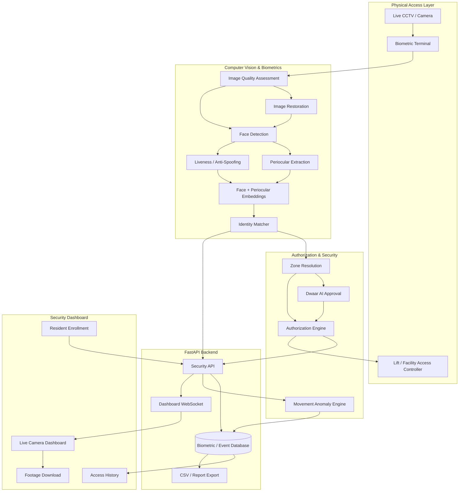

<div align="center">

# AMARYLLIS BIOMETRIC ACCESS SYSTEM

### Spatial-Temporal Biometric Identity & Access Control Platform (v1.0)
**Enterprise-Grade Residential Security System for Controlled Access Across Towers and Common Facilities**

**A computer-vision biometric access platform combining face/periocular recognition, image-quality restoration, liveness/anti-spoofing, resident authorization, visitor approval, spatial-temporal movement tracking, and auditable access logs.**

[](https://fastapi.tiangolo.com/)
[](https://opencv.org/)
[](https://react.dev/)
[](https://sqlite.org/)

[Architecture](#architecture-overview) | [Core Features](#core-features) | [Security](#biometric-security--anti-spoofing) | [Dashboard](#dashboard--reporting) | [API](#backend-api-architecture) | [Deployment](#production-deployment)

</div>

---

## Overview

The **Amaryllis Biometric Access System** is a continuous computer-vision security platform designed to control access to restricted residential facilities.

The system is intended for deployment at controlled checkpoints such as:

- Basement and ground-floor lifts in each tower
- Clubhouse
- Swimming pool
- Other restricted common areas
- Future residential entry/exit checkpoints

Instead of treating access as a simple face-recognition problem, the platform combines **identity, biometric confidence, image quality, liveness, authorization policy, location, and temporal movement history** before making an access decision.

The system is designed around the following principle:

> **Recognizing a face is not the same as authorizing access.**

A person must first be reliably identified and then evaluated against the access policy for the specific physical zone they are attempting to enter.

---

# Architecture Overview

The core pipeline operates as a continuous biometric access engine:

```text
Camera / Live Video
        │
        ▼
Frame Selection & Quality Assessment
        │
        ├── Low Quality? ──► Image Restoration / Gaussian Deblurring
        │
        ▼
Person / Face Detection
        │
        ▼
Face + Periocular Region Extraction
        │
        ▼
Liveness / Anti-Spoofing
        │
        ├── Spoof / Printed Image / Screen Replay
        │          └──► DENY
        │
        ▼
Biometric Embedding Generation
        │
        ▼
Identity Matching
        │
        ▼
Resident / Visitor / Househelp Classification
        │
        ▼
Zone & Terminal Resolution
        │
        ▼
Authorization Policy Engine
        │
        ├── Valid Resident Access
        ├── Approved Visitor
        ├── Registered Househelp
        └── Unauthorized Person
        │
        ▼
ALLOW / DENY
        │
        ├── Timestamp
        ├── Identity
        ├── Zone
        ├── Confidence
        ├── Decision Reason
        └── Movement Event
        │
        ▼
Audit Database + Dashboard + CSV Export
```

The architecture separates **biometric identification** from **authorization**, allowing the same identity engine to operate across multiple physical zones.

---

# Core Features

## 1. Continuous Live Camera Recognition

The system can consume a live camera stream and continuously inspect incoming frames for authorized individuals.

Rather than relying on a single arbitrary frame from an entire video stream, the recognition pipeline is designed to identify useful frames containing a sufficiently visible biometric region.

This is important for real-world CCTV deployments where:

- The subject may be moving
- The face may initially be small
- Motion blur may occur
- Lighting can change
- The person may temporarily turn away
- Multiple people may appear in the same frame

---

## 2. Periocular Biometric Recognition

The system uses the **periocular region** around the eyes as an additional biometric signal.

This is particularly useful when the lower half of the face is partially obscured or when full-face quality is not ideal.

The biometric pipeline can therefore combine:

```text
Full Face Features
        +
Periocular Features
        ↓
Identity Similarity Score
```

This makes the recognition layer more resilient than relying exclusively on a full-face crop.

---

## 3. Image Quality Assessment

Before attempting biometric matching, the system evaluates whether the captured frame is suitable for recognition.

Quality factors can include:

- Face visibility
- Resolution
- Sharpness
- Exposure
- Contrast
- Blur
- Biometric-region completeness

Poor-quality frames can be rejected or passed through an image-restoration stage instead of being blindly compared against enrolled identities.

---

## 4. Image Restoration / Deblurring

When a usable face is present but the frame suffers from moderate blur, the system can apply an image-restoration stage before feature extraction.

The goal is **not** to invent facial information that the camera never captured.

Instead, restoration is used to improve the visibility of an already-detected biometric region sufficiently for downstream feature extraction.

A useful production rule is:

```text
Good frame
    → recognize directly

Moderately degraded frame
    → restore → recognize

Severely degraded / no usable face
    → reject frame
```

---

## 5. Liveness & Anti-Spoofing

A critical security requirement is preventing a resident's photograph displayed on another phone from being accepted as the real resident.

The anti-spoofing layer therefore sits **before final authorization**.

The intended security pipeline is:

```text
Face detected
     ↓
Is it a real person?
     ↓
Liveness confidence
     ↓
Biometric identity match
     ↓
Authorization
```

Potential spoof indicators include:

- Flat phone-screen presentation
- Printed photograph
- Replay of a captured video
- Lack of expected facial/depth/motion characteristics
- Inconsistent temporal behavior

A high identity similarity score alone must never be treated as proof of physical presence.

---

# Resident & Visitor Access Model

## 6. Resident Enrollment

An administrator can enroll a resident through the web interface.

Enrollment stores the resident's biometric representation together with their identity information.

Example:

```text
Resident
 ├── Person ID
 ├── Name
 ├── Resident Type
 ├── Tower / Residence
 ├── Biometric Embedding
 ├── Periocular Embedding
 └── Access Policies
```

After successful enrollment, the biometric template is persisted in the backend database so the resident does not need to enroll again every time the application is restarted.

---

## 7. Resident Authorization

Identification and authorization are separate stages.

For example:

```text
Resident A
    ↓
Recognized successfully
    ↓
Tower B Lift
    ↓
Policy Check
    ↓
Authorized?
    ├── YES → ALLOW
    └── NO  → DENY
```

This allows the system to distinguish between:

- Who the person is
- Where they are attempting to go
- Whether they are allowed to access that location

---

## 8. Visitor Authorization

Non-resident visitors can be handled through an external approval workflow.

The intended flow is:

```text
Visitor
   ↓
Resident / Admin Approval
   ↓
Dwaar AI approval record
   ↓
Visitor reaches biometric checkpoint
   ↓
Biometric identification
   ↓
Active approval check
   ↓
ALLOW / DENY
```

Visitor access is therefore temporary and policy-controlled rather than permanently equivalent to resident access.

---

## 9. Househelp / Staff Recognition

The system can support recurring non-resident personnel such as:

- Domestic helpers
- Drivers
- Maintenance staff
- Cleaning personnel
- Other registered service workers

A househelp can be registered with the appropriate residence associations.

When the individual enters through a controlled checkpoint, the system can determine the relevant identity and use the configured authorization rules rather than exposing unrelated residents to unnecessary notifications.

---

# Spatial-Temporal Security

## 10. Zone-Aware Access Control

Every biometric terminal can be associated with a physical zone.

Example:

```text
Terminal ID
    │
    ├── Tower A - Basement Lift
    ├── Tower A - Ground Lift
    ├── Tower B - Basement Lift
    ├── Clubhouse
    └── Swimming Pool
```

The authorization engine evaluates the person's permissions against the requested zone.

This prevents a valid identity from automatically becoming valid everywhere.

---

## 11. Entry & Exit Timestamp Tracking

Every successful or denied biometric interaction can be recorded with a timestamp.

Example:

| Time | Person | Zone | Event | Decision |
|------|--------|------|-------|----------|
| 09:12:31 | Resident A | Tower A Lift | ENTRY | ALLOW |
| 10:43:18 | Resident A | Clubhouse | ENTRY | ALLOW |
| 11:21:04 | Resident A | Clubhouse | EXIT | ALLOW |

This creates a chronological movement history that can be used for security auditing and anomaly analysis.

---

## 12. Spatial-Temporal Anomaly Detection

The system can analyze movement sequences instead of treating every scan independently.

Examples of potentially suspicious behavior:

- Impossible movement between distant zones
- Unexpectedly short intervals
- Repeated access attempts
- Access outside an allowed time window
- Unusual movement gaps
- Identity appearing at incompatible checkpoints

The system can assign an anomaly score and retain the underlying access events for administrator review.

---

# Biometric Security & Anti-Spoofing

## Recommended Recognition Pipeline

The production biometric pipeline should follow this order:

```text
LIVE CAMERA
    ↓
Frame Sampling
    ↓
Person Detection
    ↓
Face Detection
    ↓
Face Quality Assessment
    ↓
Periocular Extraction
    ↓
Liveness / Presentation Attack Detection
    ↓
Face + Periocular Embeddings
    ↓
Identity Matching
    ↓
Confidence Threshold
    ↓
Zone Authorization
    ↓
ACCESS DECISION
```

### Important Security Principle

A photograph of a resident shown on a phone can produce a strong face embedding match if the system performs only 2D face recognition.

Therefore:

> **Identity similarity must never be the only signal used for granting physical access.**

The system should combine identity confidence with liveness and temporal evidence before opening a secured checkpoint.

---

# Dashboard & Reporting

## 1. Live Camera Dashboard

The web dashboard provides a live view of the connected camera feed.

The interface can display:

- Live video
- Current recognized person
- Recognition confidence
- Liveness status
- Current zone
- Access decision
- Event timestamp
- Recent access events

---

## 2. Live Footage Download

The live camera window provides an option to save captured footage for authorized security review.

The recording workflow can support:

```text
START RECORDING
      ↓
Live Camera Feed
      ↓
Timestamped Video
      ↓
STOP RECORDING
      ↓
Download Footage
```

Downloaded footage can be used for incident investigation and demonstration purposes.

Raw footage retention should be governed by the property's security/privacy policy.

---

## 3. Timestamp CSV Export

Security administrators can export access events as a CSV file.

The export can include:

```text
Timestamp
Person ID
Resident Name
Person Type
Terminal ID
Zone
Event Type
Decision
Match Score
Quality Score
Liveness Score
Reason
Anomaly Score
```

Example:

```csv
timestamp,person_id,name,zone,decision,match_score,liveness_score
2026-08-13 09:21:12,R001,Resident A,Tower A Lift,ALLOW,0.94,0.99
2026-08-13 09:45:08,R004,Resident B,Clubhouse,ALLOW,0.91,0.98
```

---

## 4. Time-Range Export

Administrators can specify how much historical data they want before downloading the CSV.

Example options:

```text
Last 1 hour
Last 6 hours
Last 12 hours
Last 24 hours
Last 48 hours
Custom range
```

This prevents administrators from having to manually filter a massive event database.

---

## 5. Access History

The dashboard provides chronological access history for auditing.

Administrators can inspect:

- Who entered
- Where they entered
- When they entered
- Whether access was allowed
- Why access was denied
- Biometric confidence
- Liveness confidence
- Anomaly score

---

# Backend API Architecture

The backend is implemented as a FastAPI service.

Representative endpoints include:

| Endpoint | Purpose |
|----------|---------|
| `/checkpoint/scan` | Process a biometric checkpoint scan |
| `/admin/enroll` | Enroll a new person |
| `/attestation` | Model/system attestation status |
| `/environment` | Environmental/system telemetry |
| `/zk/status` | Zero-knowledge/security status |
| `/federated/status` | Federated-learning status |
| `/teacher/summary` | Dashboard summary |
| `/ws/dashboard` | Live dashboard WebSocket |
| `/export/...` | Time-range event export |

The API can be protected using an API key and restricted through CORS to the official frontend.

---

# Core Backend Pipeline

A typical checkpoint request follows this structure:

```python
Camera Frame
    ↓
decode_image()
    ↓
assess_quality()
    ↓
restore_image() if required
    ↓
extract_periocular()
    ↓
generate_embeddings()
    ↓
identity matching
    ↓
Zone lookup
    ↓
Dwaar approval lookup
    ↓
Authorization Engine
    ↓
Biometric Event
    ↓
Access Decision
    ↓
Movement Event
    ↓
Anomaly Analysis
    ↓
Database Commit
    ↓
Dashboard / Audit / Export
```

---

# Database Architecture

The backend maintains persistent records for identities, biometric events, zones, movement events, and access decisions.

Representative entities include:

```text
Person
 ├── person_id
 ├── name
 ├── person_type
 └── policies

BiometricEvent
 ├── event_id
 ├── person_id
 ├── terminal_id
 ├── match_score
 ├── quality_score
 └── liveness_score

Zone
 ├── zone_id
 ├── terminal_id
 └── access configuration

MovementEvent
 ├── person_id
 ├── destination_zone
 └── timestamp

AccessDecision
 ├── event_id
 ├── decision
 ├── reason
 └── approved_by
```

---

# System Architecture



---

# Production Deployment

## 1. Frontend

The React/Vite frontend can be deployed on Vercel.

Example environment variables:

```text
VITE_API_URL=https://your-backend.up.railway.app
VITE_WS_URL=wss://your-backend.up.railway.app/ws/dashboard
```

The production frontend must use the exact deployed backend origin.

---

## 2. Backend

The FastAPI backend can be deployed on Railway, Render, AWS, or another container platform.

Example production command:

```bash
uvicorn main:app --host 0.0.0.0 --port $PORT
```

The backend should listen on the platform-provided `PORT`.

---

## 3. CORS

The backend should explicitly allow the deployed frontend origin.

Example:

```python
app.add_middleware(
    CORSMiddleware,
    allow_origins=[
        "https://biometric-system-rho.vercel.app"
    ],
    allow_credentials=True,
    allow_methods=["*"],
    allow_headers=["*"],
)
```

Do not include a trailing slash in the origin string.

---

# Hardware Deployment Topologies

## Topology A — Centralized Security Server

Multiple cameras feed a central security/NVR infrastructure.

```text
Tower Cameras
      ↓
Central NVR / Network
      ↓
Security Edge Server
      ↓
FastAPI Backend
      ↓
Biometric Database
```

This architecture is suitable for a residential complex with centralized IT/security infrastructure.

---

## Topology B — Local Edge Gateway

A small edge computer is installed close to each camera cluster.

Possible hardware includes:

- Intel NUC
- NVIDIA Jetson
- Mini PC
- Raspberry Pi for lightweight gateway duties

The edge node can handle video ingestion and selected computer-vision workloads before sending relevant events to the backend.

---

## Topology C — Hybrid Deployment

A hybrid design can keep camera processing close to the property while maintaining a centralized cloud dashboard.

```text
Camera
  ↓
Local Edge AI
  ↓
Encrypted API
  ↓
Cloud FastAPI
  ↓
Database
  ↓
Security Dashboard
```

This reduces unnecessary video transfer and can improve resilience when the external network is unavailable.

---

# Security & Privacy

Biometric data is highly sensitive and must be protected throughout its lifecycle.

Recommended controls include:

1. **No unnecessary raw-image retention**
2. **Encrypted biometric templates at rest**
3. **TLS/HTTPS for network communication**
4. **API authentication**
5. **Strict CORS configuration**
6. **Role-based administrator access**
7. **Audit logging**
8. **Configurable retention periods**
9. **Secure database backups**
10. **Explicit resident/visitor data governance**

The system should retain only the information necessary for the security purpose and follow the applicable privacy and data-protection requirements of the deployment jurisdiction.

---

# Anti-Spoofing Roadmap

The strongest production configuration should combine multiple independent signals.

```text
                 ┌── Face Similarity ──────┐
                 │                          │
Camera ──────────┼── Periocular Similarity ─┼──► Fusion
                 │                          │
                 ├── Liveness ──────────────┤
                 │                          │
                 └── Temporal Consistency ──┘
                                            │
                                            ▼
                                      Access Policy
                                            │
                                      ALLOW / DENY
```

This architecture specifically addresses the failure mode where a photograph displayed on a phone resembles the enrolled resident.

---

# Monitoring & Audit

Every important access event should produce an auditable record.

Example:

```text
EVENT
 ├── Event ID
 ├── Timestamp
 ├── Person
 ├── Terminal
 ├── Zone
 ├── Identity Score
 ├── Image Quality Score
 ├── Liveness Score
 ├── Authorization Decision
 ├── Decision Reason
 └── Anomaly Score
```

This makes the system suitable for post-incident investigation instead of functioning only as an access gate.

---

# Future Extensions

Potential future development areas include:

- Depth-camera based liveness
- Infrared/NIR periocular recognition
- Face anti-replay classifiers
- Multi-camera identity tracking
- Automatic gate/lift controller integration
- Resident mobile notifications
- Visitor QR + biometric two-factor access
- Emergency access policies
- Real-time suspicious movement alerts
- Central security command center
- Encrypted biometric vector storage
- Hardware-backed model attestation
- On-device ONNX inference
- Edge/offline event buffering
- Role-based security administration

---

# Example End-to-End Scenario

### Resident

```text
Resident approaches Tower A lift
        ↓
Camera captures live frames
        ↓
Face detected
        ↓
Quality checked
        ↓
Liveness verified
        ↓
Face + periocular embedding generated
        ↓
Resident matched
        ↓
Tower A Lift policy checked
        ↓
ACCESS ALLOWED
        ↓
Timestamp recorded
```

### Phone Photograph Attack

```text
Attacker displays resident photograph on phone
        ↓
Face detector finds face
        ↓
Face similarity may be high
        ↓
Liveness verification fails
        ↓
ACCESS DENIED
        ↓
Security event recorded
```

### Visitor

```text
Visitor arrives
        ↓
Biometric identity detected
        ↓
Person classified as visitor
        ↓
Dwaar AI approval checked
        ↓
Active approval exists?
      /        \
    YES        NO
     ↓          ↓
   ALLOW      DENY
     ↓          ↓
Audit event recorded
```

---

# Project Goals

The system is designed to evolve from a simple facial-recognition prototype into a complete **biometric identity + authorization + spatial-temporal security platform**.

The primary goals are:

- Reliable resident recognition
- Secure physical access control
- Strong protection against presentation attacks
- Zone-specific authorization
- Temporary visitor authorization
- Househelp/staff management
- Continuous access logging
- Spatial-temporal anomaly detection
- Security dashboard and live monitoring
- Downloadable footage
- Time-range CSV reporting
- Persistent resident enrollment
- Cloud + edge deployment capability

---

# License & Intellectual Property

**Proprietary and Confidential.**

Biometric Access System Architecture — 2026.

All biometric processing logic, authorization workflows, deployment architecture, and associated software components should be treated as project intellectual property unless explicitly released under an open-source license.
