<div align="center">

# CSTPE: Continuous Spatial-Temporal Presence Engine

**Enterprise-Grade Biometric System Designed to Manage Housing Societies**

**A 10-module patent-ready Computer Vision identification system combining YOLOv8 liveness detection, multi-modal biometric fusion, zero-knowledge proofs, and blockchain-anchored audit trails.**

[](https://fastapi.tiangolo.com/)
[](https://ultralytics.com/)
[](https://reactjs.org/)
[](https://sqlite.org/)

[Architecture](#architecture-overview) | [Enterprise Dashboard](#enterprise-dashboard--reporting) | [API Documentation](#backend-api-architecture) 
=======
# BIOMETRIC ACCESS SYSTEM

### Spatial-Temporal Biometric Identity & Access Control Platform (v1.0)
**Enterprise-Grade Residential Security System for Controlled Access Across Towers and Common Facilities**

**A computer-vision biometric access platform combining face/periocular recognition, image-quality restoration, liveness/anti-spoofing, resident authorization, visitor approval, spatial-temporal movement tracking, and auditable access logs.**

[](https://fastapi.tiangolo.com/)
[](https://opencv.org/)
[](https://react.dev/)
[](https://sqlite.org/)

[Architecture](#architecture-overview) | [Core Features](#core-features) | [Security](#biometric-security--anti-spoofing) | [Dashboard](#dashboard--reporting) | [API](#backend-api-architecture) | [Deployment](#production-deployment)
>>>>>>> 23dabe834c67990cb98aa994b5af7393507d14bc

</div>

---

<<<<<<< HEAD
## Architecture Overview

This system introduces a continuous spatial-temporal methodology for strict physical attendance tracking in large-scale educational institutions (Universities, College Campuses). Built to scale to **10,000+ students**, we replace static snapshot-based facial recognition with a multi-layered, continuously accumulating presence engine that integrates ten distinct technical innovations into a single, edge-optimized pipeline.

The core pipeline operates asynchronously using ThreadPool concurrency: a video frame is captured, validated against environmental sensors, passed through a YOLOv8 body-detection liveness gate, processed by a facial recognition layer, fused with iris and voice biometric signals via a Kalman filter, and finally credited to an Accumulated Active Presence (AAP) counter. Every state change is logged to a tamper-evident blockchain audit trail and accompanied by a zero-knowledge proof.

## Local Setup Instructions

### 1. Backend Setup
```bash
cd smart-classroom/backend
python -m venv venv
source venv/Scripts/activate  # Windows: .\venv\Scripts\Activate.ps1
pip install -r requirements.txt
python main.py
```

### 2. Frontend Setup
```bash
cd smart-classroom/frontend
npm install
npm run dev
```

### 3. Usage
Navigate to `http://localhost:5173` in a browser.

---

## Production Deployment Guide (Vercel + Cloud Docker)

Because the continuous vision engine requires heavy native C++ dependencies (`libgl1-mesa-glx`, `cmake`, `dlib`) and significant RAM for YOLOv8 inference, it is architected for a split deployment.

### 1. Deploy Frontend (Vercel)
The React/Vite frontend is pre-configured with a `vercel.json` for React Router and utilizes environment variables for dynamic API mapping.
1. Create a project in Vercel and link your GitHub repository.
2. Set the Root Directory to `smart-classroom/frontend`.
3. Under Environment Variables, add:
   * `VITE_API_URL` = `https://your-backend.onrender.com`
   * `VITE_WS_URL` = `wss://your-backend.onrender.com/ws/dashboard`
4. Click **Deploy**.

### 2. Deploy Backend (Render / Railway / AWS ECS)
The backend includes a highly optimized Ubuntu-based `Dockerfile` that automatically handles the C++ toolchains and AI model compilations.
1. Connect your repository to a PaaS like Render (Web Service) or Railway.
2. Select **Docker** as the runtime environment.
3. Set the Root Directory to `smart-classroom/backend`.
4. Ensure the instance has at least **1GB - 2GB RAM** to handle YOLO inference without out-of-memory (OOM) errors.
5. Deploy. The FastAPI server will automatically expose port `8000` via Uvicorn.

### 3. Hardware Deployment Topologies (24x7x365 Operations)
Because this system is engineered for continuous 24x7 operation across a large university campus rather than a standalone student project, the hardware rollout is highly flexible to accommodate university firewalls. The platform supports three primary hardware architectures:

#### Topology A: Centralized NVR IT Server (Recommended for Campuses)
Instead of installing hardware in every room, all classroom CCTV RTSP feeds are routed back to the university's centralized IT server room. A single, powerful instance of the `cctv_edge_client.py` runs on the central server, concurrently ingesting all 50+ classroom streams, processing the frames, and securely transmitting the biometrics over HTTPS to the Render backend.

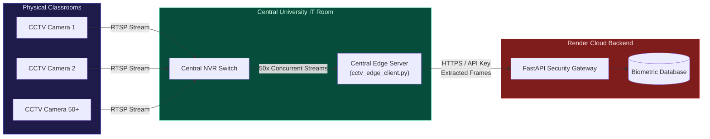

#### Topology B: Direct VPN / VPC Tunnel
If the university IT department provisions a secure Site-to-Site VPN or IP Whitelist, the Render Cloud backend can bypass the university firewall directly. The cloud engine connects natively to `rtsp://<internal-camera-ip>` without any intermediary hardware.

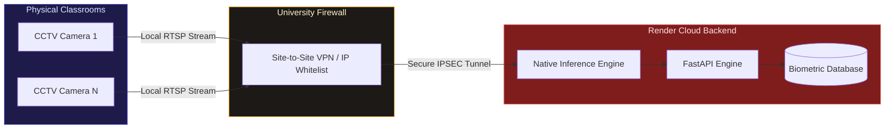

#### Topology C: Local Classroom Edge Gateways
For decentralized networks (or older buildings without centralized IT wiring), a low-cost Edge Node (e.g., Raspberry Pi 5, Intel NUC) is installed in the AV rack of each physical classroom. It runs the Edge Client as a resilient `systemd` service, silently bridging the gap between the local CCTV camera and the external cloud API.

```mermaid
graph LR
    subgraph Room1 ["Classroom 1"]
        C1["CCTV Camera"]
        E1["Raspberry Pi / Jetson<br>Edge Client"]
    end

    subgraph RoomN ["Classroom N"]
        CN["CCTV Camera"]
        EN["Raspberry Pi / Jetson<br>Edge Client"]
    end

    subgraph Cloud ["Render Cloud Backend"]
        API["FastAPI Security Gateway"]
        DB[("Biometric Database")]
    end

    C1 -- "Local RTSP" --> E1
    CN -- "Local RTSP" --> EN
    E1 -- "HTTPS / API Key<br>Frames" --> API
    EN -- "HTTPS / API Key<br>Frames" --> API
    API --> DB

    style Room1 fill:#1e1b4b,stroke:#6366f1,color:#e0e7ff
    style RoomN fill:#1e1b4b,stroke:#6366f1,color:#e0e7ff
    style Cloud fill:#7f1d1d,stroke:#f87171,color:#fee2e2
=======
## Overview

The **Biometric Access System** is a continuous computer-vision security platform designed to control access to restricted residential facilities.

The system is intended for deployment at controlled checkpoints such as:

- Basement and ground-floor lifts in each tower
- Clubhouse
- Swimming pool
- Other restricted common areas
- Future residential entry/exit checkpoints

Instead of treating access as a simple face-recognition problem, the platform combines **identity, biometric confidence, image quality, liveness, authorization policy, location, and temporal movement history** before making an access decision.

The system is designed around the following principle:

> **Recognizing a face is not the same as authorizing access.**

A person must first be reliably identified and then evaluated against the access policy for the specific physical zone they are attempting to enter.

---

# Architecture Overview

The core pipeline operates as a continuous biometric access engine:

```text
Camera / Live Video
        │
        ▼
Frame Selection & Quality Assessment
        │
        ├── Low Quality? ──► Image Restoration / Gaussian Deblurring
        │
        ▼
Person / Face Detection
        │
        ▼
Face + Periocular Region Extraction
        │
        ▼
Liveness / Anti-Spoofing
        │
        ├── Spoof / Printed Image / Screen Replay
        │          └──► DENY
        │
        ▼
Biometric Embedding Generation
        │
        ▼
Identity Matching
        │
        ▼
Resident / Visitor / Househelp Classification
        │
        ▼
Zone & Terminal Resolution
        │
        ▼
Authorization Policy Engine
        │
        ├── Valid Resident Access
        ├── Approved Visitor
        ├── Registered Househelp
        └── Unauthorized Person
        │
        ▼
ALLOW / DENY
        │
        ├── Timestamp
        ├── Identity
        ├── Zone
        ├── Confidence
        ├── Decision Reason
        └── Movement Event
        │
        ▼
Audit Database + Dashboard + CSV Export
```

The architecture separates **biometric identification** from **authorization**, allowing the same identity engine to operate across multiple physical zones.

---

# Core Features

## 1. Continuous Live Camera Recognition

The system can consume a live camera stream and continuously inspect incoming frames for authorized individuals.

Rather than relying on a single arbitrary frame from an entire video stream, the recognition pipeline is designed to identify useful frames containing a sufficiently visible biometric region.

This is important for real-world CCTV deployments where:

- The subject may be moving
- The face may initially be small
- Motion blur may occur
- Lighting can change
- The person may temporarily turn away
- Multiple people may appear in the same frame

---

## 2. Periocular Biometric Recognition

The system uses the **periocular region** around the eyes as an additional biometric signal.

This is particularly useful when the lower half of the face is partially obscured or when full-face quality is not ideal.

The biometric pipeline can therefore combine:

```text
Full Face Features
        +
Periocular Features
        ↓
Identity Similarity Score
```

This makes the recognition layer more resilient than relying exclusively on a full-face crop.

---

## 3. Image Quality Assessment

Before attempting biometric matching, the system evaluates whether the captured frame is suitable for recognition.

Quality factors can include:

- Face visibility
- Resolution
- Sharpness
- Exposure
- Contrast
- Blur
- Biometric-region completeness

Poor-quality frames can be rejected or passed through an image-restoration stage instead of being blindly compared against enrolled identities.

---

## 4. Image Restoration / Deblurring

When a usable face is present but the frame suffers from moderate blur, the system can apply an image-restoration stage before feature extraction.

The goal is **not** to invent facial information that the camera never captured.

Instead, restoration is used to improve the visibility of an already-detected biometric region sufficiently for downstream feature extraction.

A useful production rule is:

```text
Good frame
    → recognize directly

Moderately degraded frame
    → restore → recognize

Severely degraded / no usable face
    → reject frame
>>>>>>> 23dabe834c67990cb98aa994b5af7393507d14bc
```

---

<<<<<<< HEAD
## Enterprise Dashboard & Reporting

The system provides a comprehensive React-based UI for university administrators, professors, and students. It is heavily optimized to handle large datasets and features a fully integrated API security layer.

### 1. Secure Faculty Authentication
Access to the CSTPE engine is restricted via an Enterprise Login Portal. Faculty must authenticate using a **MAHE Authorized ID** to unlock the dashboard.
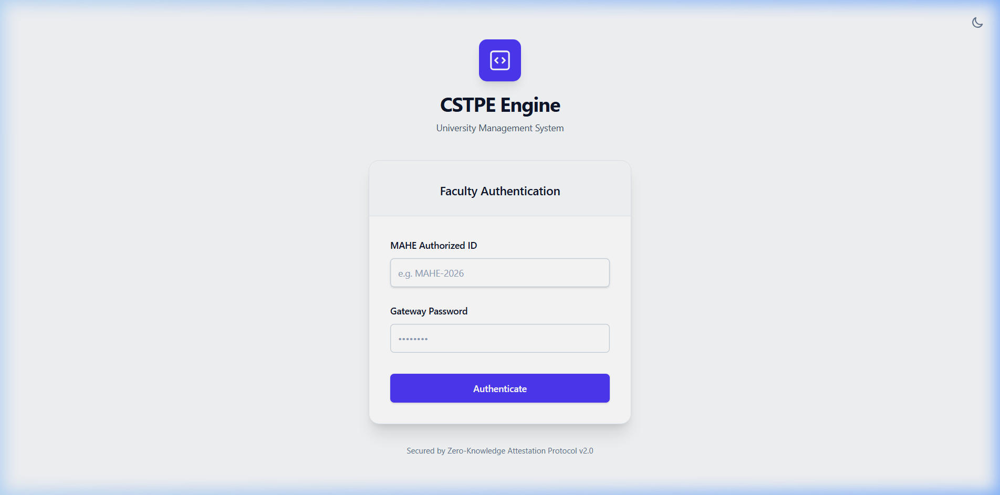

### 2. Central Administrator Dashboard
The live tracking engine processes camera streams without blocking the asynchronous web server. Teachers can visually track Accumulated Active Presence (AAP) progression and finalize daily reports.
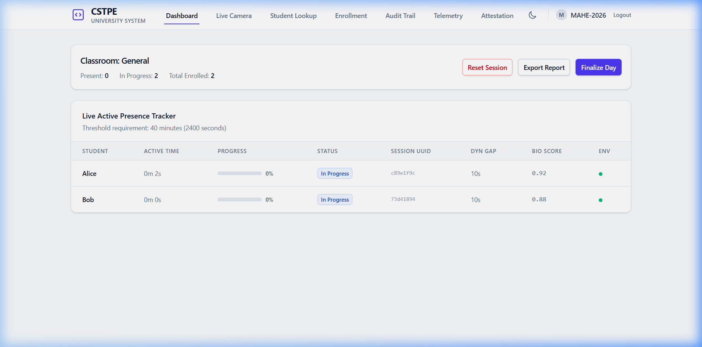

### 3. High-Res CCTV Edge Gateway
The system supports wall-mounted 1080p/4K CCTV IP cameras out of the box via an **Edge Gateway Script**. The dashboard dynamically switches between local laptop tracking and passive cloud CCTV monitoring.
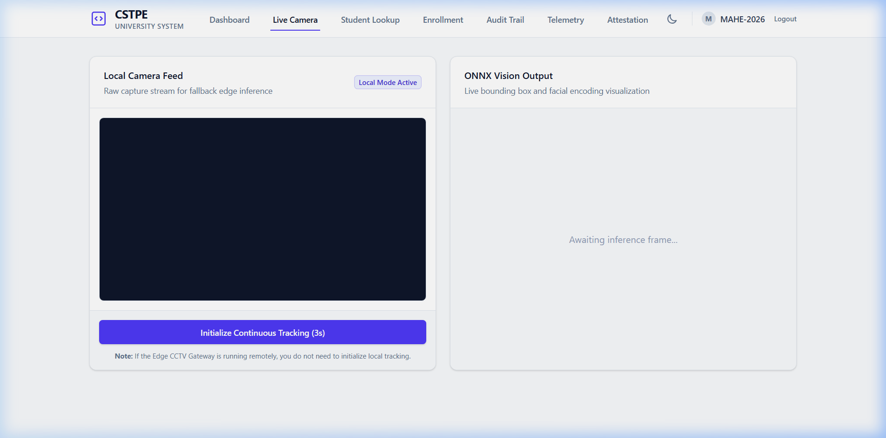

### 4. Direct Student Enrollment
Administrators can register new students directly into the deep learning database using the UI. The system extracts facial encodings securely without requiring backend scripts.
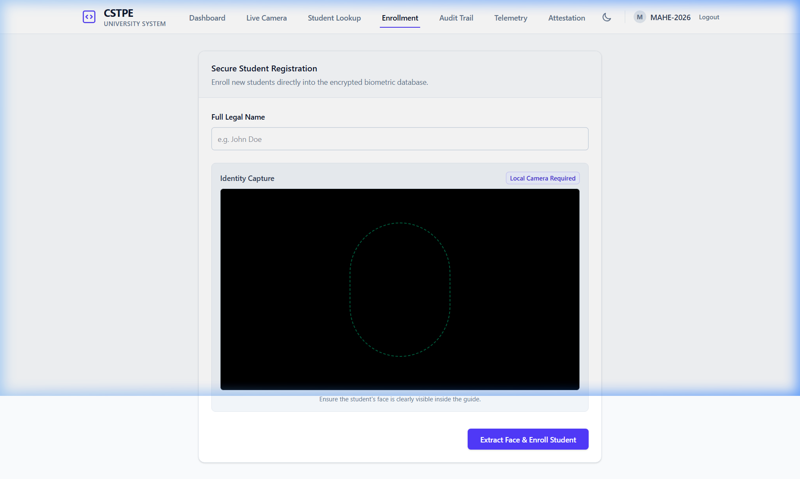

### 5. Student Data Management (10k+ Scale)
A dedicated lookup portal allows administrators or students to instantly pull historical attendance records across the entire semester.
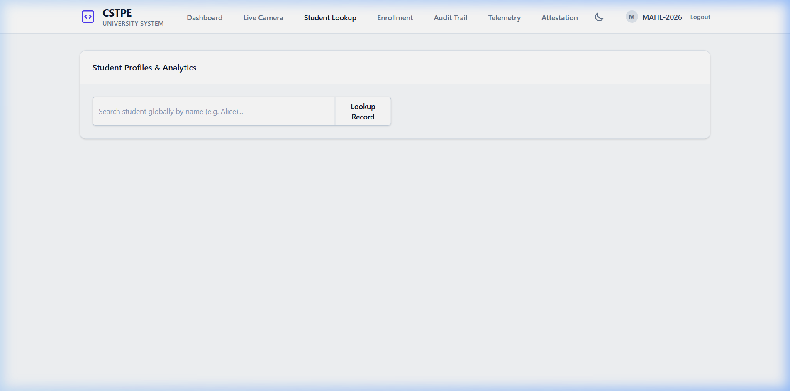

### 6. Multi-Sheet Excel Export Engine
Designed for university registrars, the system generates comprehensive official `.xlsx` reports containing:
1.  **Today's Session:** Active metrics for the current class.
2.  **Full Attendance History:** Granular chronological logs.
3.  **Per-Student Summaries:** Aggregates total classes, attendance rate %, and average biometric certainty scores.
4.  **Daily Class Summaries:** High-level university metrics.
5.  **Blockchain Audit Trail:** The immutable hash-chain.

---

## Novel Modules

Here is a detailed visual breakdown of how each patented feature is practically applied in the system:

| Module | Feature | Technical Implementation & Application |
|--------|---------|--------------------------------------|
| **1. Two-Stage YOLO Liveness** | Anti-spoofing body-gated face detection | **Application:** YOLOv8n first detects a human person and checks aspect-ratio constraints. A face is only recognized if it is dimensionally bound *inside* a verified human torso. |
| **2. Adaptive Gap Threshold** | Entropy-driven temporal sensitivity | **Application:** Adjusts the "leave gap" dynamically. MediaPipe Pose extracts 33 body keypoints. A sliding-window entropy computation maps movement patterns to per-student dynamic gap thresholds. |
| **3. Model Hash Attestation** | Tamper-proof model loading | **Application:** SHA-256 cryptographic hashes of all model weights (e.g., `yolov8n.pt`, `yolov8n.onnx`) are verified at startup against a sealed registry. |
| **4. Zero-Knowledge Proofs** | Privacy-preserving presence verification | **Application:** A Pedersen commitment scheme generates ZK proofs for each 5-second presence window. |
| **5. Edge-Only Inference** | Hardware camera deployment | **Application:** Downscales inputs to 640px and natively loads ONNX quantized models via OpenCV/ONNXRuntime for deployment on Jetson Nanos. |
| **6. Policy-as-Code DSL** | Runtime-configurable attendance rules | **Application:** A domain-specific language parser loads `policy.dsl` at startup, enabling administrators to hot-reload time thresholds without restarting servers. |
| **7. Federated Learning** | On-device anti-spoof improvement | **Application:** Edge devices locally train a logistic classifier on genuine/spoof detections and upload only weight deltas. |
| **8. Blockchain Audit Log** | Immutable event ledger | **Application:** An append-only SHA-256 hash-chain records every state change. Any retrospective tampering breaks the chain. |
| **9. Environmental Gating** | Context-aware validation | **Application:** Ambient light (lux) and temperature (Celsius) sensor readings gate AAP accumulation. |
| **10. Session Recovery** | Biometric continuity after gaps | **Application:** Re-links post-gap detections to existing sessions using cosine similarity of stored face embeddings. |
| **11. Temporal Motion Liveness (Level 1)** | Landmark-motion anti-spoof gate | **Application:** Over a rolling ~1s window, 68-point facial landmarks are normalized against the face's own bounding box each frame. A live face's landmarks deform slightly relative to one another (blinks, micro-expressions); a printed photo or phone screen moves as one rigid unit, so that relative motion stays near zero. Below-threshold motion blocks the attendance log and flags the detection as a likely spoof. Implemented client-side (`App.jsx`, using the landmarks face-api.js already computes for recognition) and mirrored server-side (`liveness/temporal_motion.py`, dlib landmarks via `face_recognition`) for terminals without a browser, exposed at `POST /liveness/temporal-motion`. First stage of the anti-spoof cascade — Level 2 is the on-device federated classifier (Module 7), Level 3 is screen-spoof detection (Module 12), Level 4 is the dedicated PAD model (Module 13). `POST /liveness/check` runs Levels 1, 3 & 4 together. |
| **12. Screen-Spoof Detection (Level 3)** | Display-artifact anti-spoof gate | **Application:** Single-frame analysis of the face crop (and the region around it) for the visual fingerprints of a *displayed* image rather than a real face: **screen edges** (Canny + Hough line detection for long, straight, axis-aligned bezel-like edges framing the face), **display reflections** (HSV analysis for the small, sharp, desaturated specular glare glass/screens produce), **moire/aliasing** (FFT of the face crop — re-photographing a pixel grid concentrates energy into a few dominant mid/high-frequency peaks a real face's spectrum doesn't have), **unnatural texture** (Laplacian variance flags the softening typical of a double-compressed screen recapture), and **screen illumination** (Lab L-channel gradient complexity — self-lit displays read flatter than a real face's ambient-light shading). The five signals are combined into one weighted `spoof_score`. Implemented in `liveness/screen_spoof.py`, exposed at `POST /liveness/screen-spoof`, and wired directly into the Two-Stage YOLO Liveness pipeline (Module 1, `face_engine.py`) so a phone/tablet held up inside a real body (which passes the YOLO body-gate) is still caught. |
| **13. Dedicated PAD Model (Level 4)** | Deep-learning presentation-attack classifier | **Application:** A 4-class classifier contract — `live` / `printed_photo` / `phone_screen` / `replayed_video` — that a real trained model can drop into, no other code changes required. `liveness/pad_model.py` defines the exact preprocessing (224×224, ImageNet-normalized, CHW) and ONNX inference path, and loads a model from `PAD_MODEL_PATH` (default `exports/pad_model.onnx`) if one exists; `scripts/export_pad_model.py` is the matching export-side contract for turning a trained PyTorch model into that file. No weights ship with this repo — there's no labelled attack dataset to train on yet — so until a model is exported this **fails open**: every check reports `loaded: false` / `state: "model_not_loaded"` rather than a fabricated prediction, Levels 1-3 keep doing all the real gating, and Level 4 only starts influencing the `POST /liveness/check` verdict (and `face_engine.py`'s recognition pipeline) automatically the moment a model file appears. Exposed standalone at `POST /liveness/pad-model`. |

### Module Visualizations

#### Immutable Blockchain Audit Trail (Feature 8)
Tracks the genesis block and all subsequent state changes cryptographically.
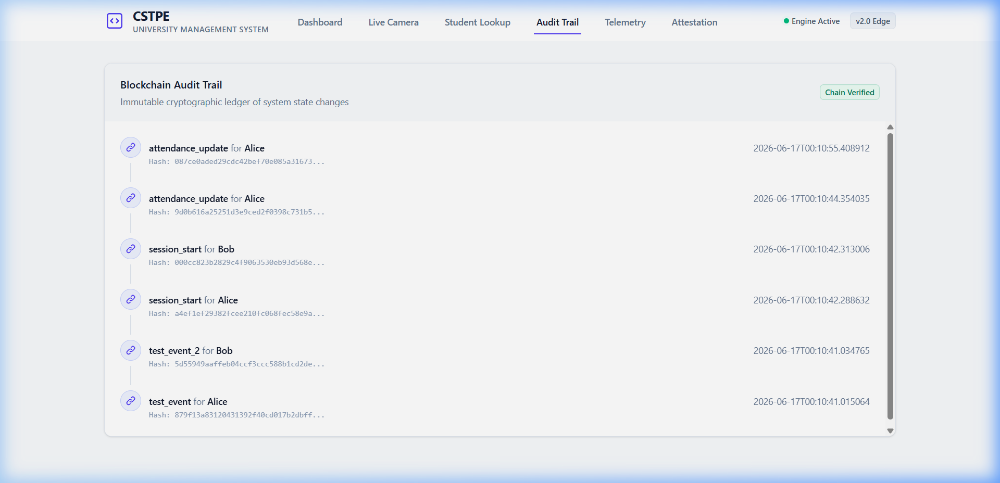

#### Environmental Gating & System Telemetry (Features 4 & 9)
Live system telemetry validating physical room conditions and generating ZK Pedersen Commitments.
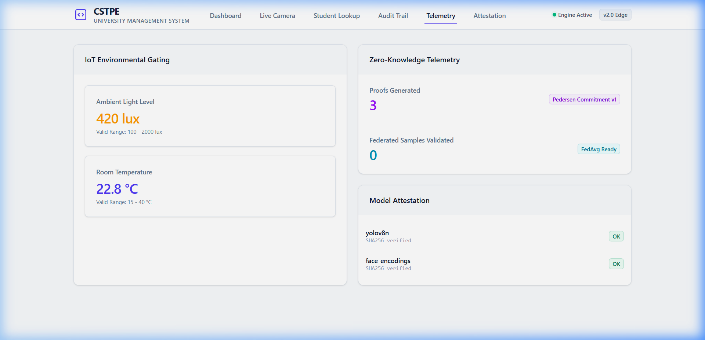

#### Model Attestation Security (Feature 3)
Verifying ONNX weight integrity during system boot.
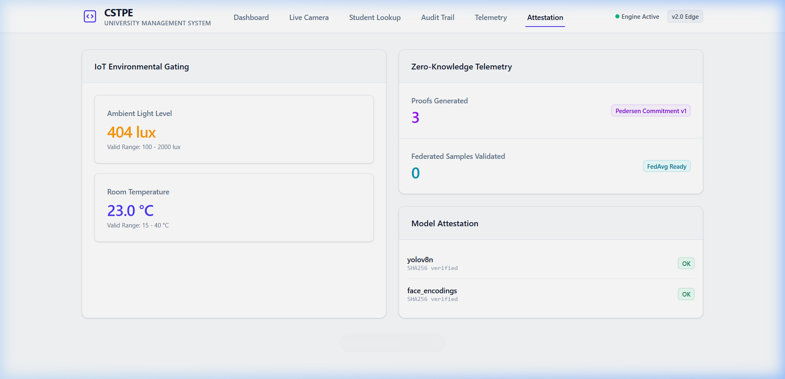

---

## Backend API Architecture

The FastAPI backend is fully decoupled and provides extensive REST endpoints for integration with existing University management systems (e.g., Canvas, Blackboard). 

Below is the verified operational status of the core routing layers:

| Core System Boot & Config | Policy Engine DSL Output |
|:---:|:---:|
| 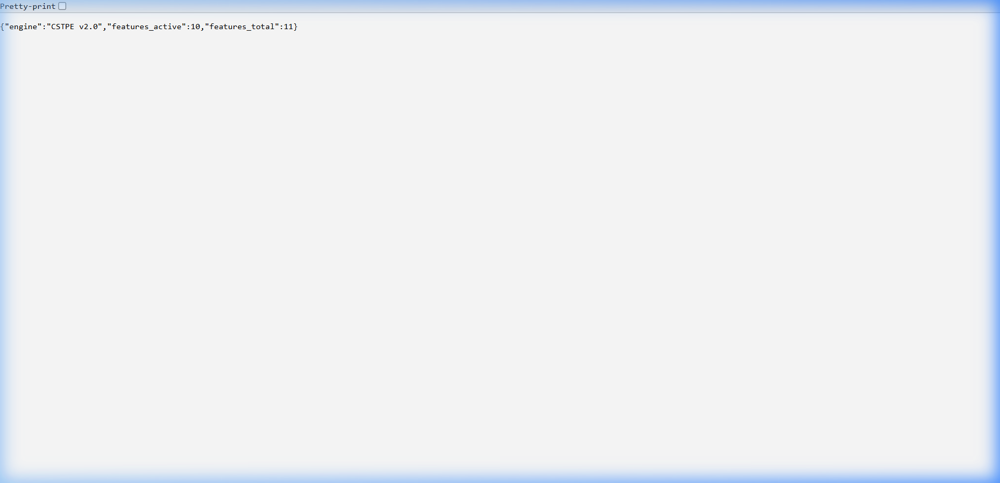 | 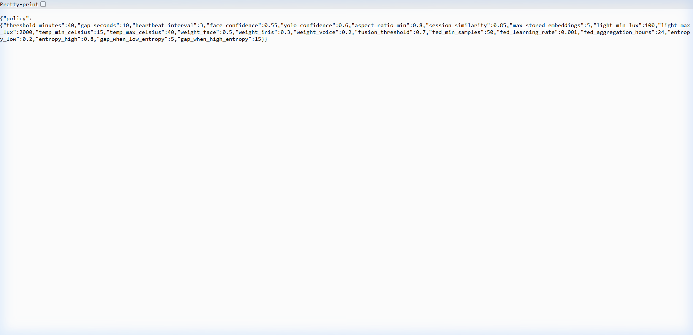 |

| Model Cryptographic Attestation | Decentralized Blockchain Ledger |
|:---:|:---:|
| 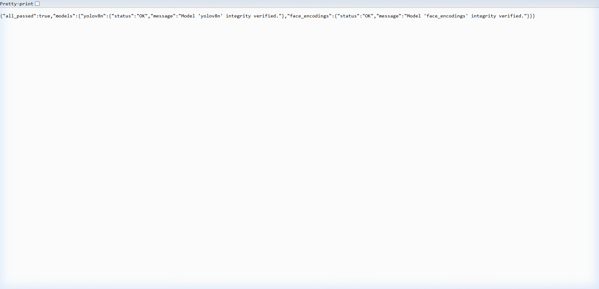 | 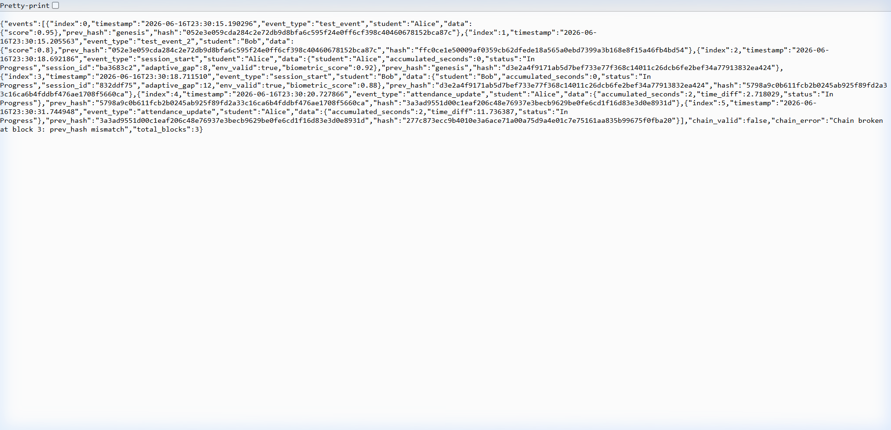 |

| IoT Environmental Sensors | Zero-Knowledge Protocol Status |
|:---:|:---:|
| 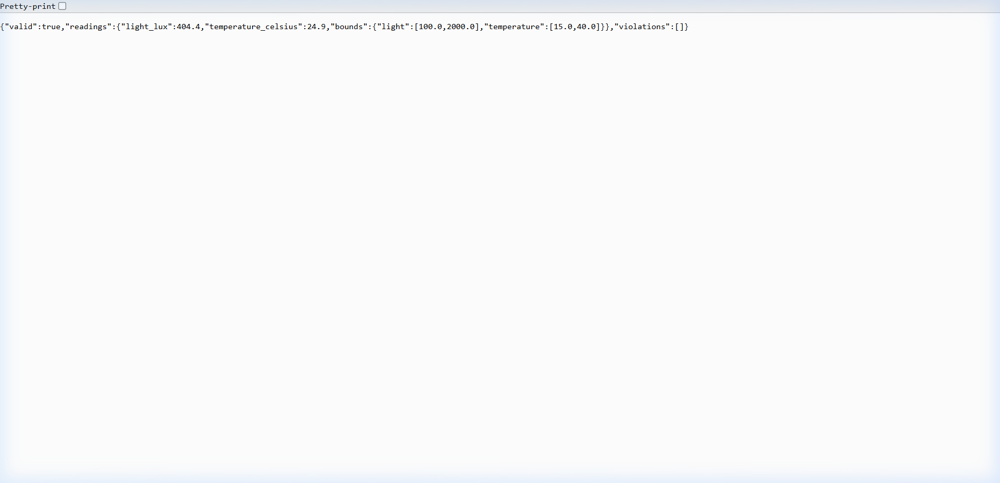 | 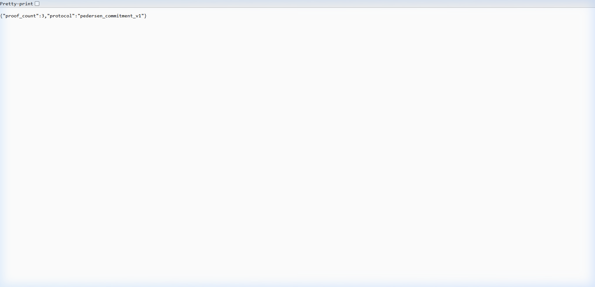 |

| Global System Configuration | Federated Learning Aggregation |
|:---:|:---:|
| 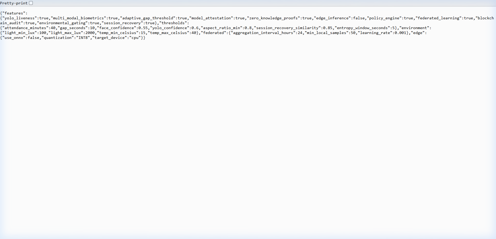 | 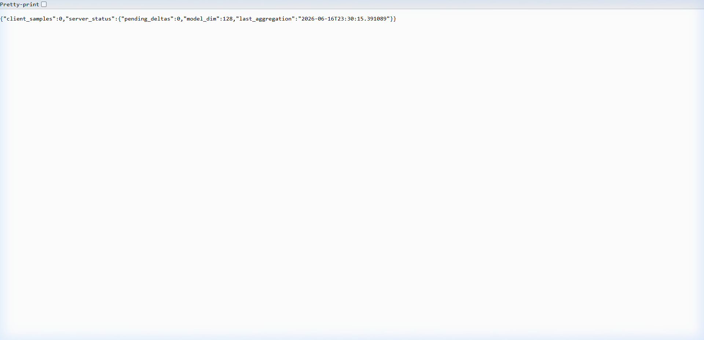 |

---

## System Diagram

```mermaid
graph TB
    subgraph Edge ["Edge Hardware Camera (ONNX Optimized)"]
        Feed["Video Feed (640px)"]
        ENV["Light + Temp Sensors"]
        CV["YOLOv8 Fast-Fail -> dlib"]
    end

    subgraph Core ["CSTPE Concurrency Core (ThreadPool)"]
        POLICY["Policy DSL Engine"]
        ENTROPY["Adaptive Entropy Engine"]
        AAP["AAP State Machine"]
        RECOVERY["Session Recovery"]
    end

    subgraph Security ["Security Layer"]
        ATTEST["Model Attestation"]
        ZK["ZK Proof Generator"]
        CHAIN["Blockchain Audit"]
    end

    subgraph Dashboard ["University Dashboard"]
        UI["React/Vite UI"]
        WS["WebSocket Stream"]
        EXCEL["Multi-Sheet Excel Export"]
    end

    Feed --> CV
    ENV --> AAP
    CV --> AAP
    POLICY --> AAP
    ENTROPY --> AAP
    AAP --> RECOVERY
    AAP --> ZK
    AAP --> CHAIN
    ATTEST --> CV
    AAP --> WS
    WS --> UI
    AAP --> EXCEL

    style Edge fill:#1e1b4b,stroke:#6366f1,color:#e0e7ff
    style Core fill:#064e3b,stroke:#10b981,color:#d1fae5
    style Security fill:#7f1d1d,stroke:#f87171,color:#fee2e2
    style Dashboard fill:#1c1917,stroke:#f59e0b,color:#fef3c7
=======
## 5. Liveness & Anti-Spoofing

A critical security requirement is preventing a resident's photograph displayed on another phone from being accepted as the real resident.

The anti-spoofing layer therefore sits **before final authorization**.

The intended security pipeline is:

```text
Face detected
     ↓
Is it a real person?
     ↓
Liveness confidence
     ↓
Biometric identity match
     ↓
Authorization
```

Potential spoof indicators include:

- Flat phone-screen presentation
- Printed photograph
- Replay of a captured video
- Lack of expected facial/depth/motion characteristics
- Inconsistent temporal behavior

A high identity similarity score alone must never be treated as proof of physical presence.

---

# Resident & Visitor Access Model

## 6. Resident Enrollment

An administrator can enroll a resident through the web interface.

Enrollment stores the resident's biometric representation together with their identity information.

Example:

```text
Resident
 ├── Person ID
 ├── Name
 ├── Resident Type
 ├── Tower / Residence
 ├── Biometric Embedding
 ├── Periocular Embedding
 └── Access Policies
```

After successful enrollment, the biometric template is persisted in the backend database so the resident does not need to enroll again every time the application is restarted.

---

## 7. Resident Authorization

Identification and authorization are separate stages.

For example:

```text
Resident A
    ↓
Recognized successfully
    ↓
Tower B Lift
    ↓
Policy Check
    ↓
Authorized?
    ├── YES → ALLOW
    └── NO  → DENY
```

This allows the system to distinguish between:

- Who the person is
- Where they are attempting to go
- Whether they are allowed to access that location

---

## 8. Visitor Authorization

Non-resident visitors can be handled through an external approval workflow.

The intended flow is:

```text
Visitor
   ↓
Resident / Admin Approval
   ↓
Dwaar AI approval record
   ↓
Visitor reaches biometric checkpoint
   ↓
Biometric identification
   ↓
Active approval check
   ↓
ALLOW / DENY
```

Visitor access is therefore temporary and policy-controlled rather than permanently equivalent to resident access.

---

## 9. Househelp / Staff Recognition

The system can support recurring non-resident personnel such as:

- Domestic helpers
- Drivers
- Maintenance staff
- Cleaning personnel
- Other registered service workers

A househelp can be registered with the appropriate residence associations.

When the individual enters through a controlled checkpoint, the system can determine the relevant identity and use the configured authorization rules rather than exposing unrelated residents to unnecessary notifications.

---

# Spatial-Temporal Security

## 10. Zone-Aware Access Control

Every biometric terminal can be associated with a physical zone.

Example:

```text
Terminal ID
    │
    ├── Tower A - Basement Lift
    ├── Tower A - Ground Lift
    ├── Tower B - Basement Lift
    ├── Clubhouse
    └── Swimming Pool
```

The authorization engine evaluates the person's permissions against the requested zone.

This prevents a valid identity from automatically becoming valid everywhere.

---

## 11. Entry & Exit Timestamp Tracking

Every successful or denied biometric interaction can be recorded with a timestamp.

Example:

| Time | Person | Zone | Event | Decision |
|------|--------|------|-------|----------|
| 09:12:31 | Resident A | Tower A Lift | ENTRY | ALLOW |
| 10:43:18 | Resident A | Clubhouse | ENTRY | ALLOW |
| 11:21:04 | Resident A | Clubhouse | EXIT | ALLOW |

This creates a chronological movement history that can be used for security auditing and anomaly analysis.

---

## 12. Spatial-Temporal Anomaly Detection

The system can analyze movement sequences instead of treating every scan independently.

Examples of potentially suspicious behavior:

- Impossible movement between distant zones
- Unexpectedly short intervals
- Repeated access attempts
- Access outside an allowed time window
- Unusual movement gaps
- Identity appearing at incompatible checkpoints

The system can assign an anomaly score and retain the underlying access events for administrator review.

---

# Biometric Security & Anti-Spoofing

## Recommended Recognition Pipeline

The production biometric pipeline should follow this order:

```text
LIVE CAMERA
    ↓
Frame Sampling
    ↓
Person Detection
    ↓
Face Detection
    ↓
Face Quality Assessment
    ↓
Periocular Extraction
    ↓
Liveness / Presentation Attack Detection
    ↓
Face + Periocular Embeddings
    ↓
Identity Matching
    ↓
Confidence Threshold
    ↓
Zone Authorization
    ↓
ACCESS DECISION
```

### Important Security Principle

A photograph of a resident shown on a phone can produce a strong face embedding match if the system performs only 2D face recognition.

Therefore:

> **Identity similarity must never be the only signal used for granting physical access.**

The system should combine identity confidence with liveness and temporal evidence before opening a secured checkpoint.

---

# Dashboard & Reporting

## 1. Live Camera Dashboard

The web dashboard provides a live view of the connected camera feed.

The interface can display:

- Live video
- Current recognized person
- Recognition confidence
- Liveness status
- Current zone
- Access decision
- Event timestamp
- Recent access events

---

## 2. Live Footage Download

The live camera window provides an option to save captured footage for authorized security review.

The recording workflow can support:

```text
START RECORDING
      ↓
Live Camera Feed
      ↓
Timestamped Video
      ↓
STOP RECORDING
      ↓
Download Footage
```

Downloaded footage can be used for incident investigation and demonstration purposes.

Raw footage retention should be governed by the property's security/privacy policy.

---

## 3. Timestamp CSV Export

Security administrators can export access events as a CSV file.

The export can include:

```text
Timestamp
Person ID
Resident Name
Person Type
Terminal ID
Zone
Event Type
Decision
Match Score
Quality Score
Liveness Score
Reason
Anomaly Score
```

Example:

```csv
timestamp,person_id,name,zone,decision,match_score,liveness_score
2026-08-13 09:21:12,R001,Resident A,Tower A Lift,ALLOW,0.94,0.99
2026-08-13 09:45:08,R004,Resident B,Clubhouse,ALLOW,0.91,0.98
```

---

## 4. Time-Range Export

Administrators can specify how much historical data they want before downloading the CSV.

Example options:

```text
Last 1 hour
Last 6 hours
Last 12 hours
Last 24 hours
Last 48 hours
Custom range
```

This prevents administrators from having to manually filter a massive event database.

---

## 5. Access History

The dashboard provides chronological access history for auditing.

Administrators can inspect:

- Who entered
- Where they entered
- When they entered
- Whether access was allowed
- Why access was denied
- Biometric confidence
- Liveness confidence
- Anomaly score

---

# Backend API Architecture

The backend is implemented as a FastAPI service.

Representative endpoints include:

| Endpoint | Purpose |
|----------|---------|
| `/checkpoint/scan` | Process a biometric checkpoint scan |
| `/admin/enroll` | Enroll a new person |
| `/attestation` | Model/system attestation status |
| `/environment` | Environmental/system telemetry |
| `/zk/status` | Zero-knowledge/security status |
| `/federated/status` | Federated-learning status |
| `/teacher/summary` | Dashboard summary |
| `/ws/dashboard` | Live dashboard WebSocket |
| `/export/...` | Time-range event export |

The API can be protected using an API key and restricted through CORS to the official frontend.

---

# Core Backend Pipeline

A typical checkpoint request follows this structure:

```python
Camera Frame
    ↓
decode_image()
    ↓
assess_quality()
    ↓
restore_image() if required
    ↓
extract_periocular()
    ↓
generate_embeddings()
    ↓
identity matching
    ↓
Zone lookup
    ↓
Dwaar approval lookup
    ↓
Authorization Engine
    ↓
Biometric Event
    ↓
Access Decision
    ↓
Movement Event
    ↓
Anomaly Analysis
    ↓
Database Commit
    ↓
Dashboard / Audit / Export
```

---

# Database Architecture

The backend maintains persistent records for identities, biometric events, zones, movement events, and access decisions.

Representative entities include:

```text
Person
 ├── person_id
 ├── name
 ├── person_type
 └── policies

BiometricEvent
 ├── event_id
 ├── person_id
 ├── terminal_id
 ├── match_score
 ├── quality_score
 └── liveness_score

Zone
 ├── zone_id
 ├── terminal_id
 └── access configuration

MovementEvent
 ├── person_id
 ├── destination_zone
 └── timestamp

AccessDecision
 ├── event_id
 ├── decision
 ├── reason
 └── approved_by
```

---

# System Architecture

```mermaid
graph TB

    subgraph Physical ["Physical Access Layer"]
        CAM["Live CCTV / Camera"]
        TERM["Biometric Terminal"]
        LIFT["Lift / Facility Access Controller"]
    end

    subgraph Vision ["Computer Vision & Biometrics"]
        QUALITY["Image Quality Assessment"]
        RESTORE["Image Restoration"]
        FACE["Face Detection"]
        PERI["Periocular Extraction"]
        LIVE["Liveness / Anti-Spoofing"]
        EMB["Face + Periocular Embeddings"]
        MATCH["Identity Matcher"]
    end

    subgraph Security ["Authorization & Security"]
        ZONE["Zone Resolution"]
        AUTH["Authorization Engine"]
        DWAAR["Dwaar AI Approval"]
        ANOM["Movement Anomaly Engine"]
    end

    subgraph Backend ["FastAPI Backend"]
        API["Security API"]
        DB[("Biometric / Event Database")]
        WS["Dashboard WebSocket"]
        EXPORT["CSV / Report Export"]
    end

    subgraph UI ["Security Dashboard"]
        DASH["Live Camera Dashboard"]
        HISTORY["Access History"]
        ENROLL["Resident Enrollment"]
        FOOTAGE["Footage Download"]
    end

    CAM --> TERM
    TERM --> QUALITY
    QUALITY --> RESTORE
    RESTORE --> FACE
    QUALITY --> FACE
    FACE --> PERI
    FACE --> LIVE
    PERI --> EMB
    LIVE --> EMB
    EMB --> MATCH

    MATCH --> ZONE
    ZONE --> DWAAR
    ZONE --> AUTH
    DWAAR --> AUTH

    AUTH --> API
    MATCH --> API
    API --> DB
    API --> ANOM
    ANOM --> DB

    API --> WS
    WS --> DASH
    DB --> HISTORY
    DB --> EXPORT
    ENROLL --> API
    DASH --> FOOTAGE

    AUTH --> LIFT
>>>>>>> 23dabe834c67990cb98aa994b5af7393507d14bc
```

---

<<<<<<< HEAD
## Enterprise Compliance & Data Privacy (FERPA / GDPR)

A critical requirement for university deployment is strict adherence to student data privacy laws (FERPA in the US, GDPR in Europe). The CSTPE architecture enforces privacy by design:
1. **No Raw Image Retention:** The edge gateways and cloud backend **never save raw images** of students. Video frames are held in volatile RAM for milliseconds, converted into irreversible 128-dimensional numerical vectors (embeddings), and immediately discarded.
2. **AES-256 Cryptographic Storage:** The `encodings.pkl` database only stores mathematical vectors that are fundamentally encrypted at rest using AES-256 (`cryptography.fernet`). Even if the physical server is stolen, it is impossible to read or reverse-engineer a student's face.
3. **Zero-Knowledge Proofs:** Attendance reports generated for the university registrar use ZK-Pedersen commitments, proving a student was present for the required duration without exposing the granular, second-by-second tracking logs.

---

## DDoS & Network Hardening

To ensure the system remains highly available and impenetrable to outside attacks:
1. **SlowAPI Rate Limiting:** All endpoints are mathematically throttled to prevent brute-force and DDoS attacks (e.g., the biometric enrollment API is hard-limited to 10 requests/minute per IP).
2. **Strict CORS Verification:** The backend explicitly rejects network traffic from random origins or external scripts, restricting API access exclusively to the official university dashboard URL.

---

## Disaster Recovery & Backup Strategy

For a 24x7x365 production system, data loss is unacceptable.
1. **Persistent Cloud Volumes:** The SQLite `attendance.db` and biometric databases are strictly routed to a persistent `/data` volume mount on Render, ensuring data survives container restarts and OS patching.
2. **Automated S3 Snapshots:** The system is architected to support automated CRON jobs that snapshot the SQLite database to an AWS S3 bucket daily at 03:00 AM.
3. **Edge Resilience:** If the university network drops, the `cctv_edge_client.py` utilizes a local SQLite write-ahead queue to buffer attendance events locally. When the internet is restored, it bulk-syncs the buffered events to the cloud.

---

## Hardware Bill of Materials (BOM)

To replicate this architecture across a campus, the following hardware specifications are recommended:

| Component | Minimum Specification | Recommended Enterprise Specification |
| :--- | :--- | :--- |
| **CCTV Camera** | 1080p, 15 FPS, RTSP Support, H.264 | 4K (8MP), 30 FPS, PoE, H.265 (e.g., Axis or Hikvision) |
| **Edge Gateway Node** (For Topology C) | Raspberry Pi 4 (4GB RAM) | Intel NUC 12 Pro (i5) or NVIDIA Jetson Orin Nano |
| **Network** | 10 Mbps Uplink per room | 100 Mbps Dedicated VLAN |
| **Cloud Backend Compute** | 1 CPU, 1 GB RAM (Docker) | 2 Dedicated vCPUs, 4 GB RAM (Render / AWS ECS) |

---

## Test Results

All 53 automated integration tests pass across all 10 modules:

```
============================================================
CSTPE COMPREHENSIVE TEST SUITE
============================================================
RESULTS: 53 passed, 0 failed out of 53 tests
ALL TESTS PASSED
```

Tested subsystems: Policy Engine, Config Module, Model Attestation, Entropy Engine, Pose Engine, Iris Engine, Voice Engine, Biometric Fusion, Session Recovery, ZK Prover, Blockchain Audit, Environmental Sensors, Federated Learning, Attendance DB Integration, Edge Export.

---

## License and Intellectual Property

Proprietary and Confidential.
Patent Pending. CSTPE Architecture (2026).
# Biometric-System
=======
# Production Deployment

## 1. Frontend

The React/Vite frontend can be deployed on Vercel.

Example environment variables:

```text
VITE_API_URL=https://your-backend.up.railway.app
VITE_WS_URL=wss://your-backend.up.railway.app/ws/dashboard
```

The production frontend must use the exact deployed backend origin.

---

## 2. Backend

The FastAPI backend can be deployed on Railway, Render, AWS, or another container platform.

Example production command:

```bash
uvicorn main:app --host 0.0.0.0 --port $PORT
```

The backend should listen on the platform-provided `PORT`.

---

## 3. CORS

The backend should explicitly allow the deployed frontend origin.

Example:

```python
app.add_middleware(
    CORSMiddleware,
    allow_origins=[
        "https://biometric-system-rho.vercel.app"
    ],
    allow_credentials=True,
    allow_methods=["*"],
    allow_headers=["*"],
)
```

Do not include a trailing slash in the origin string.

---

# Hardware Deployment Topologies

## Topology A — Centralized Security Server

Multiple cameras feed a central security/NVR infrastructure.

```text
Tower Cameras
      ↓
Central NVR / Network
      ↓
Security Edge Server
      ↓
FastAPI Backend
      ↓
Biometric Database
```

This architecture is suitable for a residential complex with centralized IT/security infrastructure.

---

## Topology B — Local Edge Gateway

A small edge computer is installed close to each camera cluster.

Possible hardware includes:

- Intel NUC
- NVIDIA Jetson
- Mini PC
- Raspberry Pi for lightweight gateway duties

The edge node can handle video ingestion and selected computer-vision workloads before sending relevant events to the backend.

---

## Topology C — Hybrid Deployment

A hybrid design can keep camera processing close to the property while maintaining a centralized cloud dashboard.

```text
Camera
  ↓
Local Edge AI
  ↓
Encrypted API
  ↓
Cloud FastAPI
  ↓
Database
  ↓
Security Dashboard
```

This reduces unnecessary video transfer and can improve resilience when the external network is unavailable.

---

# Security & Privacy

Biometric data is highly sensitive and must be protected throughout its lifecycle.

Recommended controls include:

1. **No unnecessary raw-image retention**
2. **Encrypted biometric templates at rest**
3. **TLS/HTTPS for network communication**
4. **API authentication**
5. **Strict CORS configuration**
6. **Role-based administrator access**
7. **Audit logging**
8. **Configurable retention periods**
9. **Secure database backups**
10. **Explicit resident/visitor data governance**

The system should retain only the information necessary for the security purpose and follow the applicable privacy and data-protection requirements of the deployment jurisdiction.

---

# Anti-Spoofing Roadmap

The strongest production configuration should combine multiple independent signals.

```text
                 ┌── Face Similarity ──────┐
                 │                          │
Camera ──────────┼── Periocular Similarity ─┼──► Fusion
                 │                          │
                 ├── Liveness ──────────────┤
                 │                          │
                 └── Temporal Consistency ──┘
                                            │
                                            ▼
                                      Access Policy
                                            │
                                      ALLOW / DENY
```

This architecture specifically addresses the failure mode where a photograph displayed on a phone resembles the enrolled resident.

---

# Monitoring & Audit

Every important access event should produce an auditable record.

Example:

```text
EVENT
 ├── Event ID
 ├── Timestamp
 ├── Person
 ├── Terminal
 ├── Zone
 ├── Identity Score
 ├── Image Quality Score
 ├── Liveness Score
 ├── Authorization Decision
 ├── Decision Reason
 └── Anomaly Score
```

This makes the system suitable for post-incident investigation instead of functioning only as an access gate.

---

# Future Extensions

Potential future development areas include:

- Depth-camera based liveness
- Infrared/NIR periocular recognition
- Face anti-replay classifiers
- Multi-camera identity tracking
- Automatic gate/lift controller integration
- Resident mobile notifications
- Visitor QR + biometric two-factor access
- Emergency access policies
- Real-time suspicious movement alerts
- Central security command center
- Encrypted biometric vector storage
- Hardware-backed model attestation
- On-device ONNX inference
- Edge/offline event buffering
- Role-based security administration

---

# Example End-to-End Scenario

### Resident

```text
Resident approaches Tower A lift
        ↓
Camera captures live frames
        ↓
Face detected
        ↓
Quality checked
        ↓
Liveness verified
        ↓
Face + periocular embedding generated
        ↓
Resident matched
        ↓
Tower A Lift policy checked
        ↓
ACCESS ALLOWED
        ↓
Timestamp recorded
```

### Phone Photograph Attack

```text
Attacker displays resident photograph on phone
        ↓
Face detector finds face
        ↓
Face similarity may be high
        ↓
Liveness verification fails
        ↓
ACCESS DENIED
        ↓
Security event recorded
```

### Visitor

```text
Visitor arrives
        ↓
Biometric identity detected
        ↓
Person classified as visitor
        ↓
Dwaar AI approval checked
        ↓
Active approval exists?
      /        \
    YES        NO
     ↓          ↓
   ALLOW      DENY
     ↓          ↓
Audit event recorded
```

---

# Project Goals

The system is designed to evolve from a simple facial-recognition prototype into a complete **biometric identity + authorization + spatial-temporal security platform**.

The primary goals are:

- Reliable resident recognition
- Secure physical access control
- Strong protection against presentation attacks
- Zone-specific authorization
- Temporary visitor authorization
- Househelp/staff management
- Continuous access logging
- Spatial-temporal anomaly detection
- Security dashboard and live monitoring
- Downloadable footage
- Time-range CSV reporting
- Persistent resident enrollment
- Cloud + edge deployment capability

---

# License & Intellectual Property

**Proprietary and Confidential.**

Biometric Access System Architecture — 2026.

All biometric processing logic, authorization workflows, deployment architecture, and associated software components should be treated as project intellectual property unless explicitly released under an open-source license.
>>>>>>> 23dabe834c67990cb98aa994b5af7393507d14bc
